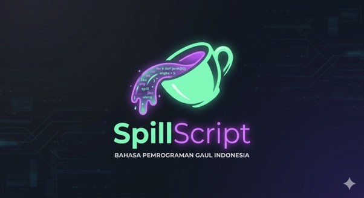

[📖 README](README.md) | [👥 Contributing](CONTRIBUTING.md) | [⚖️ MIT License](LICENSE) | [💡 Solusi](SOLUSI.md)
   ---

# SpillScript

[](https://github.com/habibmuzakkipiliang)
[]()
[]()

SpillScript adalah bahasa pemrograman baru dengan sintaks berbahasa Indonesia yang gaul dan mudah dipahami. Terinspirasi dari JavaScript, Python, dan TypeScript.



## Daftar Isi

- [Tentang SpillScript](#tentang-spillscript)
- [Fitur Utama](#fitur-utama)
- [Struktur Dasar](#struktur-dasar)
- [Tipe Data](#tipe-data)
- [Operator](#operator)
- [Kontrol Alur](#kontrol-alur)
- [Perulangan](#perulangan)
- [Koleksi Data](#koleksi-data)
- [Fungsi](#fungsi)
- [Error Handling](#error-handling)
- [Contoh Kode](#contoh-kode)

---

## Tentang SpillScript

SpillScript dirancang untuk membuat pemrograman lebih mudah diakses bagi penutur bahasa Indonesia. Dengan sintaks yang natural dan familiar, SpillScript memungkinkan siapa saja untuk mulai coding tanpa harus mempelajari istilah-istilah teknis Inggris yang rumit.

## Fitur Utama

- **Sintaks Bahasa Indonesia**: Kata kunci dan struktur menggunakan bahasa Indonesia sehari-hari
- **Dinamically Typed**: Tipe data dinamis seperti Python dan JavaScript
- **Type Hinting Opsional**: Terinspirasi dari TypeScript untuk keamanan tambahan
- **Modern Features**: Mendukung fitur-fitur bahasa pemrograman modern

---

## Struktur Dasar

### Komentar

```spillscript
// Ini adalah komentar baris tunggal

/*
Ini adalah komentar
multiline
*/
```

### Memulai Hello World

```spillscript
// Hello World
spill("Hello World")

```

### Variabel

```spillscript
// Deklarasi variabel
var nama = "Habib"

// Deklarasi dengan let
let umur = 20

// Deklarasi konstan
fiks PI = 3.14159
```

---

## Tipe Data

SpillScript memiliki tipe data yang dinamis, tapi juga mendukung type hinting opsional.

### Type Hinting

```spillscript
let umur : ang = 20
let nama : teks = "Halo Dunia"
let desimal : des = 23.23
let hasil : cek = bener
let huruf : char = 'A'
```

### Kamus Tipe Data

| SpillScript | English   | Deskripsi            |
| ----------- | --------- | -------------------- |
| `ang`       | int       | Angka bulat          |
| `des`       | float     | Angka desimal        |
| `teks`      | string    | Teks/string          |
| `cek`       | bool      | Boolean (true/false) |
| `char`      | char      | Karakter tunggal     |
| `kosong`    | null/None | Nilai kosong         |

### Manipulasi String (Interpolasi)

```spillscript
// F-string style
let nama = "Habib"
spill(f"Halo, nama saya {nama}")

// Multiline
spill(f"""
Ini adalah teks
multiline dengan nama {nama}
""")
```

### Input Data

```spillscript
// Input angka
let yuk = ang(minta("Masukkan angka : "))
spill("Tes angka = ", yuk)

// Input desimal
let duf = des(minta("Masukkan desimal : "))
spill("Tes desimal = ", duf)

// Input teks
let fur = minta("Masukkan nama kamu : ")
spill("Halo ", fur, " Saya dari Indonesia")
```

---

## Operator

### Operator Aritmatika

| Operator | Deskripsi      |
| -------- | -------------- |
| `+`      | Penjumlahan    |
| `-`      | Pengurangan    |
| `*`      | Perkalian      |
| `/`      | Pembagian      |
| `%`      | Modulus (Sisa) |
| `**`     | Pangkat        |

### Operator Perbandingan

| Operator | Deskripsi               |
| -------- | ----------------------- |
| `==`     | Sama dengan             |
| `!=`     | Tidak sama dengan       |
| `>`      | Lebih dari              |
| `<`      | Kurang dari             |
| `>=`     | Lebih dari sama dengan  |
| `<=`     | Kurang dari sama dengan |

### Operator Logika

| Operator | Deskripsi |
| -------- | --------- |
| `dan`    | AND       |
| `ato`    | OR        |
| `gak`    | NOT       |

### Operator Boolean

| Operator | Deskripsi |
| -------- | --------- |
| `bener`  | True      |
| `salah`  | False     |

### Operator Penugasan Gabungan

| Operator | Contoh   | Sama dengan |
| -------- | -------- | ----------- |
| `+=`     | `a += 5` | `a = a + 5` |
| `-=`     | `a -= 5` | `a = a - 5` |
| `*=`     | `a *= 5` | `a = a * 5` |
| `/=`     | `a /= 5` | `a = a / 5` |

---

## Kontrol Alur

### If-Else Dasar

```spillscript
var angka = 9

jika angka > 5:
    spill("Besar")
maka:
    spill("Kecil")
```

### If-Else If-Else

```spillscript
let angka_1 = 10

jika angka_1 > 5:
    spill("Besar")
silau angka_1 < 5:
    spill("kecil")
maka:
    spill("sama saja")
```

### Nested If (1)

```spillscript
var tor = 9
var cek = bener

jika cek:
    jika tor > 5:
        spill("Besar")
    silau tor < 5:
        spill("kecil")
maka:
    spill("sama saja")
```

### Nested If (2)

```spillscript
var yor  = 9
var cek = bener

jika cek:
     jika yor > 5:
         spill("Besar")
     maka:
        spill("Kecil")
maka:
    spill("Sama saja")

```

### Switch Case (Angka)

```spillscript
let dun = 2

alih (dun):
    kes 1:
        spill("Oke")
    kes 2:
        spill("Belum oke")
    kes 3:
        spill("Masih belum Oke")
    kes _:
        spill("Biasa aja deh")
```

### Switch Case (String)

```spillscript
let kondisi = "Tidak"

alih (kondisi):
    kes "Iya":
        spill("Iya")
    kes "Tidak":
        spill("Tidak")
    kes "Kadang-Kadang":
        spill("Kadang-kadang")
    kes _:
        spill("Biasa aja deh")
```

---

## Perulangan

### For Loop

```spillscript
ulang k dari jarak(10):
    spill("Urutan ke - ", k)
```

### While Loop

```spillscript
var tes = 5

saat tes < 20:
    spill("Urutan ke -", tes)
    tes = tes + 1
```

### While Loop dengan Assignment Singkat

```spillscript
var tes = 5

saat tes < 20:
    spill("Urutan ke -", tes)
    tes += 1
```

### Do While Loop

```spillscript
var lan = 10

dor:
    spill("Urutan ke -", lan)
    lan = lan + 1
saat lan < 20:
```

### Do While Loop Singkat

```spillscript
var lan = 10

dor:
    spill("Urutan ke -", lan)
    lan += 1
saat lan < 20:
```

### Nested For Loop

```spillscript
ulang a dari jarak(4):
    ulang b dari jarak(4):
        spill(f" a = {a}, b = {b}")
```

### Continue (Melewatkan Iterasi)

```spillscript
ulang i dari jarak(1, 6):
    jika i == 3:
        lanjutkan
    spill("Angka : ", i)
```

### Break (Menghentikan Loop)

```spillscript
ulang a dari jarak(1, 6):
    jika a == 3:
        hentikan
    spill("Angka :", a)
```

### Continue dengan List

```spillscript
let angka_p = [11, 12, 13, 14, 15, 16, 17, 18, 19, 20]

ulang n dari angka_p:
    jika n == 15:
        lanjutkan
    spill("Angka terpilih : ", n)
```

### Break dengan List (Mencari Data)

```spillscript
let buah_buahan = ["apel", "jeruk", "mangga", "pisang", "anggur"]

ulang buah dari buah_buahan:
    spill("Memeriksa : ", buah)
    jika buah == "mangga":
        spill("-> Mangga ketemu! Hentikan pencarian.")
        hentikan
```

---

## Koleksi Data

### Array

```spillscript
var lon = [1, 2, 3, 4, 5, 6, 7, 8, 9]

ulang a dari lon:
    spill(a)
```

### Set

```spillscript
var use = {1, 2, 3, 4, 5, 6, 7, 8, 9}
```

### Tuple

```spillscript
var hun = (1, 2, 3, 4, 5, 6, 7, 8, 9)
```

### Dictionary

```spillscript
fiks biodata = {
    "nama"  : "Habib Muzakki",
    "asal"  : "Jakarta",
    "kerja" : "Programmer",
    "usia" : 20,
    "coding" : "HTML, CSS, JavaScript dan Python",
}

spill("Nama : ", biodata["nama"])
spill("Asal : ", biodata["asal"])
spill("Kerja : ", biodata["kerja"])
spill("Usia : ", biodata["usia"])
spill("Coding : ", biodata["coding"])
```

---

---------------------------------------------------------------------------------------------------------

### Fungsi dasar 

``` spillscript
gas dasar():
    spill("Hello World")

dasar()

```

---------------------------------------------------------------------------------------------------------

### Fungsi dasar dengan parameter 

``` spillscript
gas kop(nama):
    spill ("Hello ", nama)

kop("Hayyan”)

```

---------------------------------------------------------------------------------------------------------

### Fungsi dasar dengan return 

``` spillscript
gas sun(nama):
    balik("Hello ", nama)

hasil = sun("Soft")
spill(hasil)

```

---------------------------------------------------------------------------------------------------------

### Fungsi dasar dengan parameter (F String)

``` spillscript
gas kop(nama):
    spill(f”Hello  {nama}”)

kop(“Hayyan”)
kop(“Ruyyan”)
kop(“Dankut”)
kop(“Ruft”)

```

---------------------------------------------------------------------------------------------------------

### Fungsi dasar dengan return (F String)

``` spillscript
gas sun(nama):
    balik(f”Hello  {nama}”)

hasil = sun(“Hayyan”)
spill(hasil)

```

---------------------------------------------------------------------------------------------------------


## Error Handling

```spillscript
coba:
    var hasil = 10 / 0
    spill(hasil)
kecuali DivisiKosongEror:
    spill("Gagal")
maka:
    spill("Oke")
akhir:
    spill("Berhasil")
```

---

## Contoh Kode

Berikut adalah contoh kode lengkap SpillScript:

```spillscript
// Program Hitung Luas Lingkaran
fiks PI = 3.14159

gas hitungLuasLingkaran(jari_jari):
    balik PI * jari_jari * jari_jari

let jari_jari = ang(minta("Masukkan jari-jari lingkaran: "))
let luas = hitungLuasLingkaran(jari_jari)

spill(f"Luas lingkaran dengan jari-jari {jari_jari} adalah {luas}")
```

---

## Struktur File

```
SpillScript-lang-spesification/
├── README.md                          # Dokumentasi utama
├── Desain dan Tahap Awal Iseng SpillScript Code Coding.docx
├── SpillScript-logo-icon.jpg          # Logo SpillScript
└── examples/
    └── SpillScript.sps               # Contoh kode SpillScript
```

---

## Penulis

**Habib Muzakki Piliang**

- GitHub: [@habibmuzakkipiliang](https://github.com/habibmuzakkipiliang)

---

## Lisensi

MIT License

---

**Terima kasih telah melihat SpillScript!** 🚀
